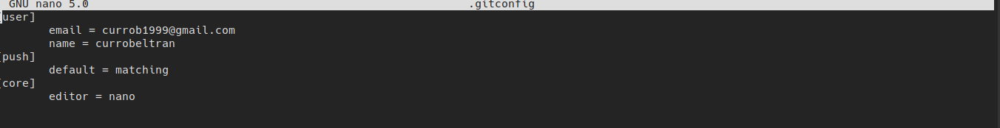

# Configuración del entorno de desarrollo

## Configuración de git

Para comprobar que se ha configurado correctamente git, mostramos la siguiente captura de pantalla donde podemos observar el nombre y el correo correspondiente a los commits que se realizarán:

En cuanto a la configuración de las claves público-privadas, vemos en la siguiente captura de pantalla que existe un par de claves que se encuentra en funcionamiento:

Además, en la siguiente captura comprobamos que efectivamente la url remota se corresponde con la utilizada para clonar el repositorio a través de ssh:

