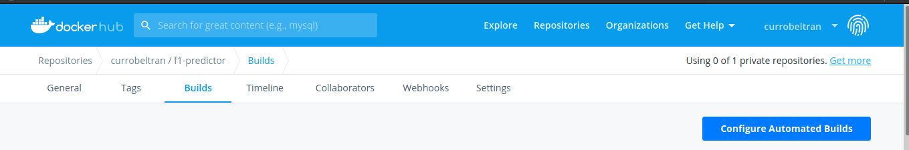
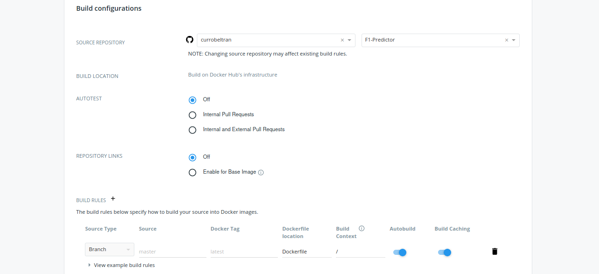

# Información sobre el contenedor de test

## ¿Qué contenedor base se ha escogido?

Para este contenedor hemos escogido como base el que provee go en su versión 1.15 (la utilizada a la hora de desarrollar el código existente) sobre alpine, ya que en este caso, solo se van a ejecutar tests sobre el código del proyecto; una tarea muy liviana y que no requiere en nuestro caso unas grandes prestaciones (con esta imagen la tarea tarda en realizarse unos 0.003s). Es por ello que prima la cantidad de espacio que ocupa la imagen del sistema (ya que la descarga de la imagen será el proceso que más tiempo consuma); y en este caso alpine es muy poco pesada en comparación con otras imágenes oficiales de go (unos 300MB).

Otras alternativas existentes son:

- Golang:1.15. Esta tiene un peso bastante mayor(unos 800MB) y el rendimiento a la hora de ejecutar las comprobaciones es prácticamente el mismo; por tanto la acusada diferencia de tiempo a la hora de descargar es lo que provoca que, para este caso específico, esta versión quede descartada.

- Golang:1.15-buster. Básicamente tenemos el mismo análisis que con la versión comentada anteriormente, ya que el peso es el mismo y no se aprecian mejoras en el rendimiento respecto a la versión alpine.

## ¿Qué proceso sigue el archivo dockerfile?

Si observamos el código de este fichero, vemos que sigue unos sencillos pasos, que son los siguientes:

- Primero, se especifica el contenedor base que utilizará el nuestro (especificado anteriormente).

- Después, establecemos el directorio de trabajo, llamado test (donde se debe montar el proyecto); y copiamos aquí dentro el makefile que hemos creado para realizar la tarea de test.

- Se ejecutan los comandos correspondientes para poder tener la herramienta make disponible en nuestro contenedor.

- Creamos un nuevo usuario y establecemos el mismo como el que ejecutará los siguientes comandos, que en este caso únicamente será make test. Este paso donde se crea un nuevo usuario es opcional, pero se realiza por seguridad ya que no será necesario privilegios de superusuario para ejecutar el comando necesario.

## ¿Cómo enlazar nuestros repositorios de GitHub y DockerHub?

La realización de este proceso es muy simple, ya que dentro de nuestro repositorio en DockerHub tendremos que situarnos en la sección "Builds" y pulsar sobre "Configure Automated Builds"

Obtendremos esta pantalla:

En la cual tendremos que establecer con que repositorio queremos enlazar y establecer una regla de construcción que indique en que lugar de nuestro proyecto se encuentra el archivo dockerfile, desde el cual se construirá nuestro contenedor.
